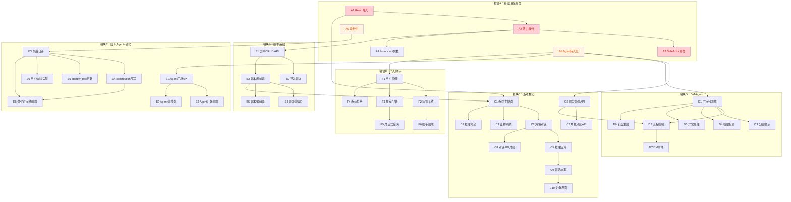

# 进化酒馆 · 功能分配文档

> 基于 `游戏-AI剧本杀.md` 需求 + `evo-murder-game` 现有代码，拆分可分配的功能模块和任务。

---

## 一、项目现状速查

### 已完成（可运行）

| 模块 | 文件 | 状态 |
|------|------|------|
| EvoMap A2A 协议客户端 | `api/evomap/evomap_client.py` | 9大端点全覆盖（hello/session/memory/council/task/recipe/credit/fetch/help） |
| Agent 三角色体系 | `api/agents/agent_orchestrator.py` | DM / Companion / Assistant 枚举 + 模板 + 注册 |
| 三层LLM管道 | `api/llm/llm_service.py` | initial → critique → refine，6种 provider |
| ORM 数据模型 | `api/db/models.py` | Script / Character / AgentNode / GameSession / ConversationTurn / EvolutionRecord |
| Pydantic 类型 | `api/schemas/invoke_types.py` | Actor / SafeActor / 6种 Request/Response |
| 配置管理 | `api/config/settings.py` + `.env.example` | LLM / EvoMap / DB / 图像生成 |
| 前端路由 | `web/src/App.tsx` | /library /play/:id /agents /evolution |
| 前端类型 | `web/src/types/index.ts` | 完整 TypeScript 类型定义 |
| 前端 API 层 | `web/src/api/invoke.ts` | invoke / register / list / heartbeat / evolve / session / memory |
| 前端状态管理 | `web/src/providers/contexts.tsx` | 4个 Provider（Mystery/Session/Script/Agent） |
| Agent 配置面板 | `web/src/pages/AgentPanel.tsx` | 注册 + 列表展示 |
| 协作规范 | `docs/协作规范.md` | Git/代码风格/安全红线/开发顺序 |

### 骨架占位（需实现）

| 模块 | 文件 | 当前状态 |
|------|------|---------|
| 游戏主界面 | `web/src/pages/GamePage.tsx` | 只有标题和文字列表 |
| 剧本库 | `web/src/pages/ScriptLibrary.tsx` | 有筛选UI，但无后端对接 |
| 进化时间线 | `web/src/pages/EvolutionTimeline.tsx` | 硬编码示例数据 |
| 路由拆分 | `api/routes/` | 空目录，所有路由在 main.py |

### 已知 Bug / 缺陷

| # | 问题 | 严重度 |
|---|------|--------|
| B1 | `contexts.tsx` React 导入顺序错误，运行时会报错 | 阻塞 |
| B2 | `SafeActor` 包含 `is_killer` 字段，泄露凶手身份 | 高 |
| B3 | `broadcast_message` 端点参数未封装为 Pydantic 模型 | 中 |
| B4 | `EvoMapClient` 用同步 httpx，阻塞 FastAPI 事件循环 | 中 |
| B5 | Agent 状态仅存内存，重启丢失 | 中 |
| B6 | `database.py` 和 `models.py` 函数重复 | 低 |
| B7 | `evolveAgent` 前端发送空 `node_id` | 低 |

---

## 二、模块拆分与任务分配

### 模块 A：后端基础设施（优先修）

> 不修这些，其他模块跑不起来

| 任务ID | 任务 | 涉及文件 | 依赖 | 建议分配 |
|--------|------|---------|------|---------|
| A1 | 修复 `contexts.tsx` React 导入顺序 | `web/src/providers/contexts.tsx` | 无 | 任何人，5分钟 |
| A2 | 路由拆分：main.py → routes/agents.py + routes/game.py + routes/invoke.py + routes/memory.py | `api/main.py` → `api/routes/*.py` | 无 | 后端1 |
| A3 | SafeActor 移除 `is_killer`，前后端同步 | `api/schemas/invoke_types.py` + `web/src/types/index.ts` + `web/src/api/invoke.ts` | 无 | 后端1 |
| A4 | `broadcast_message` 参数封装为 Pydantic 模型 | `api/schemas/invoke_types.py` + `api/routes/game.py` | A2 | 后端1 |
| A5 | `EvoMapClient` 改为异步（httpx.AsyncClient） | `api/evomap/evomap_client.py` | 无 | 后端2 |
| A6 | Agent 状态持久化：注册/心跳写入数据库，启动时恢复 | `api/agents/agent_orchestrator.py` + `api/db/models.py` | A2 | 后端2 |
| A7 | 删除重复的 `database.py`，统一用 `models.py` | `api/db/database.py` | A2 | 后端2 |
| A8 | `llm_service.py` Client 单例化 | `api/llm/llm_service.py` | 无 | 后端2 |

---

### 模块 B：剧本系统

> 对应需求 1.1-1.3

| 任务ID | 任务 | 涉及文件 | 依赖 | 建议分配 |
|--------|------|---------|------|---------|
| B1 | 剧本 CRUD API（增删改查 + 列表/搜索/筛选） | `api/routes/scripts.py`（新建） | A2 | 后端1 |
| B2 | 剧本数据导入：从 ai-murder-mystery 的6个剧本导入数据库 | `scripts/import_scripts.py`（新建） | B1 | 后端1 |
| B3 | 剧本库前端对接后端 API | `web/src/pages/ScriptLibrary.tsx` + `web/src/api/invoke.ts` | B1 | 前端1 |
| B4 | 剧本详情页（封面/简介/标签/人数/时长/难度/情感/推理/恐怖） | `web/src/pages/ScriptDetail.tsx`（新建） | B3 | 前端1 |
| B5 | 剧本编辑器（从 ai-murder-mystery 复用改造） | `web/src/components/ScriptEditor/`（新建） | B3 | 前端2 |
| B6 | 剧本推荐接口（个人助手 Agent 调用） | `api/routes/scripts.py` | E3 | 后端2 |

---

### 模块 C：游戏核心

> 对应需求 2.1 / 5 / 6 / 7

| 任务ID | 任务 | 涉及文件 | 依赖 | 建议分配 |
|--------|------|---------|------|---------|
| C1 | 游戏主界面：角色选择 + 对话界面 | `web/src/pages/GamePage.tsx` | A1, B3 | 前端1 |
| C2 | 角色对话组件（从 ai-murder-mystery Actor.tsx 复用改造） | `web/src/components/ActorChat.tsx`（新建） | C1 | 前端1 |
| C3 | 证物系统（从 ai-murder-mystery evidence/ 复用改造） | `web/src/components/evidence/`（新建） | C1 | 前端2 |
| C4 | 推理笔记（从 ai-murder-mystery EnhancedNotesPanel 复用） | `web/src/components/NotesPanel.tsx`（新建） | C1 | 前端2 |
| C5 | 推理结算：选凶手 + 选动机 + AI生成选项 | `web/src/components/ReasoningSubmit.tsx`（新建） | C2 | 前端1 |
| C6 | 游戏阶段管理 API（intro → investigation → voting → reveal → review） | `api/routes/game.py` | A2, A6 | 后端1 |
| C7 | 角色分配 API（用户选角 + Agent 匹配角色） | `api/routes/game.py` | A6 | 后端1 |
| C8 | 对话 API 对接（/invoke 流式 SSE） | `api/routes/invoke.py` + `web/src/api/invoke.ts` | A2, C2 | 后端2 |
| C9 | 剧透故事生成（游戏结束后 AI 生成完整真相） | `api/routes/game.py` + `web/src/components/SpoilerModal.tsx` | C6 | 后端2 |
| C10 | 游戏复盘界面 | `web/src/pages/ReviewPage.tsx`（新建） | C5, C9 | 前端1 |

---

### 模块 D：DM-Agent

> 对应需求 4 / DM功能List

| 任务ID | 任务 | 涉及文件 | 依赖 | 建议分配 |
|--------|------|---------|------|---------|
| D1 | DM-Agent 主持包加载（完整真相 + 流程节点 + 线索发放规则） | `api/agents/dm_agent.py`（新建） | A6 | 后端1 |
| D2 | DM 流程控制 API（开始/结束/暂停/恢复阶段，发放线索，触发事件） | `api/routes/game.py` | D1, C6 | 后端1 |
| D3 | DM 分级提示系统（4级：提醒目标 → 遗漏信息 → 推理方向 → 强提示） | `api/agents/dm_agent.py` | D1 | 后端1 |
| D4 | DM 权限检查（剧透拦截 + Agent 违规检测 + 私聊合法性） | `api/agents/dm_agent.py` | D1 | 后端2 |
| D5 | DM 异常处理（掉线/无响应/循环/卡住） | `api/agents/dm_agent.py` | D1 | 后端2 |
| D6 | DM 复盘生成（证据链 + 时间线 + 角色动机 + 质量报告） | `api/agents/dm_agent.py` | D1, C9 | 后端2 |
| D7 | DM 前端界面（主持状态面板 + 提示按钮 + 阶段指示器） | `web/src/components/DMPanel.tsx`（新建） | D2, C1 | 前端2 |

---

### 模块 E：陪玩 Agent + 进化

> 对应需求 3 / 陪玩Agent功能List

| 任务ID | 任务 | 涉及文件 | 依赖 | 建议分配 |
|--------|------|---------|------|---------|
| E1 | Agent 广场 API（列表/搜索/筛选/详情） | `api/routes/agents.py` | A2, A6 | 后端1 |
| E2 | Agent 广场前端（浏览/搜索/筛选/详情/收藏） | `web/src/pages/AgentMarket.tsx`（新建） | E1 | 前端1 |
| E3 | Agent 局后自评（结构化评分 + 经验记录到 Memory） | `api/agents/companion_agent.py`（新建） | A5, A6 | 后端2 |
| E4 | Agent 进化：constitution 改写（根据自评结果自动修改行为规则） | `api/agents/evolution_engine.py`（新建） | E3 | 后端2 |
| E5 | Agent 进化：identity_doc 更新（根据长期经验调整自我认知） | `api/agents/evolution_engine.py` | E3 | 后端2 |
| E6 | Agent 用户体验适配（发言少时主动邀请、新手时间接帮助等） | `api/agents/companion_agent.py` | E3 | 后端2 |
| E7 | 多 Agent 协作（避免刷屏/重复/无条件附和，留真人空间） | `api/agents/collaboration.py`（新建） | A5 | 后端2 |
| E8 | 进化时间线前端对接后端 API | `web/src/pages/EvolutionTimeline.tsx` | E3, E4 | 前端2 |
| E9 | Agent 详情页（人设/风格/能力/评价/进化版本/最近标签） | `web/src/pages/AgentDetail.tsx`（新建） | E1 | 前端1 |

---

### 模块 F：个人助手 Agent

> 对应需求 8 / 个人助手Agent功能List

| 任务ID | 任务 | 涉及文件 | 依赖 | 建议分配 |
|--------|------|---------|------|---------|
| F1 | 用户画像生成（偏好/难度/角色/社交/节奏/推理特点） | `api/agents/assistant_agent.py`（新建） | A6 | 后端2 |
| F2 | 用户标签系统（标签名/类型/置信度/依据/更新时间/用户确认） | `api/agents/assistant_agent.py` + `api/db/models.py` 新增 UserTag | F1 | 后端2 |
| F3 | 推荐引擎（剧本/角色/Agent阵容/DM） | `api/agents/assistant_agent.py` | F1, F2 | 后端2 |
| F4 | 游玩总结（单局/周报/月报/偏好趋势） | `api/agents/assistant_agent.py` | F1 | 后端2 |
| F5 | 对话式服务（"今天玩什么""找不抢话的Agent"） | `api/routes/assistant.py`（新建） | F3 | 后端2 |
| F6 | 个人助手前端（画像/标签/推荐/总结） | `web/src/pages/AssistantPage.tsx`（新建） | F1, F2 | 前端2 |

---

### 模块 G：组队模式

> 对应需求 2.2

| 任务ID | 任务 | 涉及文件 | 依赖 | 建议分配 |
|--------|------|---------|------|---------|
| G1 | 房间系统（创建/加入/邀请/大厅/自动补位） | `api/routes/rooms.py`（新建） + WebSocket | C6 | 后端1 |
| G2 | 实时同步（WebSocket 消息广播） | `api/routes/ws.py`（新建） | G1 | 后端1 |
| G3 | 组队前端（房间列表/创建/邀请/等待/Agent补位） | `web/src/pages/RoomPage.tsx`（新建） | G1 | 前端1 |

---

## 三、开发阶段规划

### 第一阶段：核心骨架（Demo 可跑）

> 目标：单人模式完整流程跑通

```
A1 修复React导入 ──→ A2 路由拆分 ──→ A3 SafeActor修复
       │                    │
       ▼                    ▼
     A5 异步化           B1 剧本CRUD ──→ B2 导入剧本 ──→ B3 剧本库前端
       │                    │
       ▼                    ▼
     A6 Agent持久化      C6 游戏阶段API ──→ C7 角色分配API
       │                    │
       ▼                    ▼
     C1 游戏主界面 ←──── C2 角色对话 ──→ C8 对话API对接
                            │
                            ▼
                         C5 推理结算 ──→ C9 剧透故事 ──→ C10 复盘界面
```

**必做任务**：A1-A6, B1-B3, C1-C2, C5-C8
**可跳过**：A7-A8（优化项）, B4-B6, C3-C4, C9-C10

### 第二阶段：Agent 进化

> 目标：Agent 能从对局中学习并改进

**必做任务**：D1-D3, E1-E5, E8
**可跳过**：D4-D7, E6-E7, E9

### 第三阶段：完整体验

> 目标：所有需求功能可用

**必做任务**：D4-D7, E6-E7, E9, F1-F4, C3-C4, C9-C10, B4-B5
**可跳过**：F5-F6, G1-G3, B6

### 第四阶段：增强

> 目标：锦上添花

**任务**：F5-F6, G1-G3, B6

---

## 四、建议分工

### 后端1（核心流程）

> 负责 API 骨架 + 剧本 + 游戏 + DM

| 阶段 | 任务 |
|------|------|
| 第一阶段 | A2, A3, A4, B1, B2, C6, C7 |
| 第二阶段 | D1, D2, D3, E1 |
| 第三阶段 | D4, D6, B4 |

### 后端2（Agent + EvoMap）

> 负责 EvoMap 集成 + Agent 进化 + 个人助手

| 阶段 | 任务 |
|------|------|
| 第一阶段 | A5, A6, A7, A8, C8 |
| 第二阶段 | E3, E4, E5, E8 |
| 第三阶段 | E6, E7, F1, F2, F3, F4 |

### 前端1（游戏界面）

> 负责剧本库 + 游戏主界面 + 对话 + 推理

| 阶段 | 任务 |
|------|------|
| 第一阶段 | A1, B3, C1, C2, C5 |
| 第二阶段 | E2, E9 |
| 第三阶段 | C10, B5 |

### 前端2（Agent + 辅助界面）

> 负责 Agent 面板 + 证物 + 笔记 + DM + 进化 + 助手

| 阶段 | 任务 |
|------|------|
| 第一阶段 | C3, C4 |
| 第二阶段 | D7, E8 |
| 第三阶段 | F6, B5 |

---

## 五、任务依赖关系图



---

## 六、快速认领表

> 复制此表到群里，每人认领后打 ✅

| 任务ID | 任务简述 | 认领人 | 状态 |
|--------|---------|--------|------|
| A1 | 修复React导入顺序 | | |
| A2 | 路由拆分 main.py → routes/ | | |
| A3 | SafeActor 移除 is_killer | | |
| A4 | broadcast 参数封装 | | |
| A5 | EvoMapClient 异步化 | | |
| A6 | Agent 状态持久化 | | |
| A7 | 删除重复 database.py | | |
| A8 | LLM Client 单例化 | | |
| B1 | 剧本 CRUD API | | |
| B2 | 导入6个剧本到数据库 | | |
| B3 | 剧本库前端对接API | | |
| B4 | 剧本详情页 | | |
| B5 | 剧本编辑器 | | |
| C1 | 游戏主界面 | | |
| C2 | 角色对话组件 | | |
| C3 | 证物系统 | | |
| C4 | 推理笔记 | | |
| C5 | 推理结算 | | |
| C6 | 游戏阶段管理API | | |
| C7 | 角色分配API | | |
| C8 | 对话API对接（流式SSE） | | |
| C9 | 剧透故事生成 | | |
| C10 | 游戏复盘界面 | | |
| D1 | DM主持包加载 | | |
| D2 | DM流程控制API | | |
| D3 | DM分级提示 | | |
| D4 | DM权限检查 | | |
| D5 | DM异常处理 | | |
| D6 | DM复盘生成 | | |
| D7 | DM前端面板 | | |
| E1 | Agent广场API | | |
| E2 | Agent广场前端 | | |
| E3 | Agent局后自评 | | |
| E4 | constitution改写 | | |
| E5 | identity_doc更新 | | |
| E6 | 用户体验适配 | | |
| E7 | 多Agent协作 | | |
| E8 | 进化时间线前端 | | |
| E9 | Agent详情页 | | |
| F1 | 用户画像生成 | | |
| F2 | 用户标签系统 | | |
| F3 | 推荐引擎 | | |
| F4 | 游玩总结 | | |
| F5 | 对话式服务 | | |
| F6 | 个人助手前端 | | |
